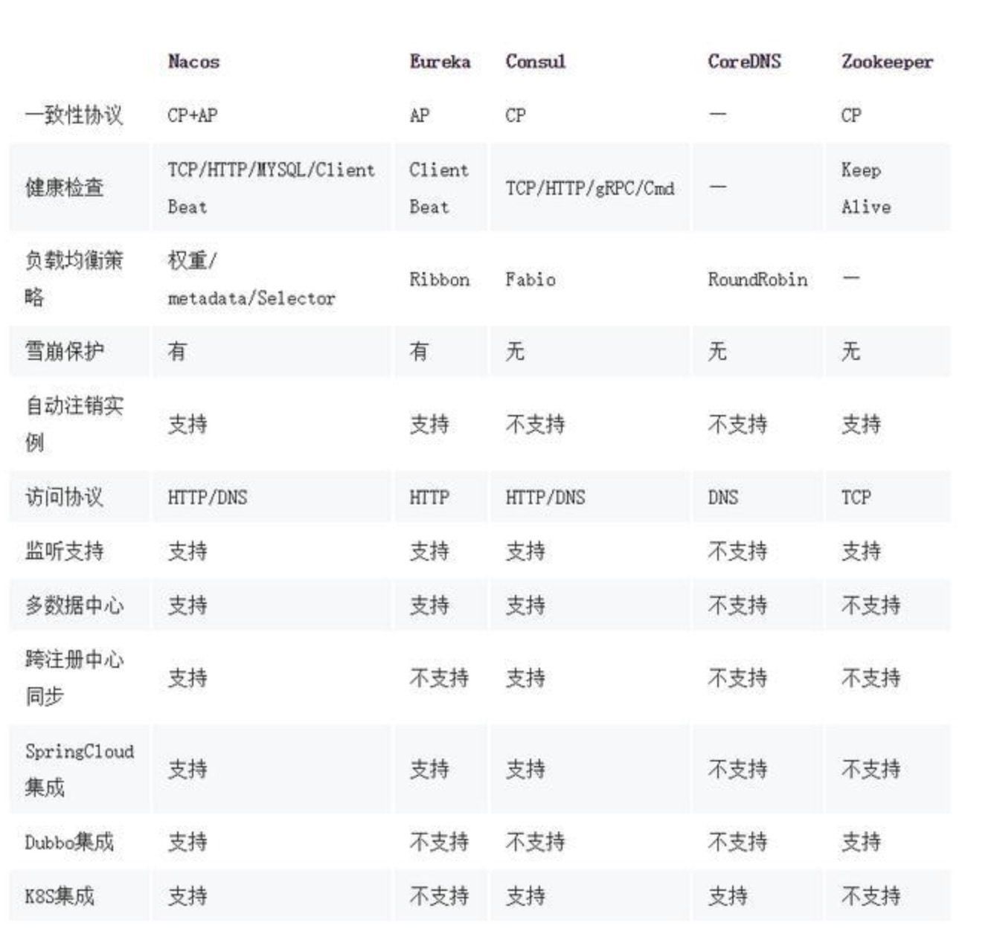

# Dahub平台后端框架选型与技术难点分析

***背景***

1、由于公司后端技术栈以`java`为主，同时也有部分中间件用`python`实现。所以此块技术围绕`java`生态圈展开，同时希望异构语言的支持性较好。

2、由于现在团队人员较为紧缺，且平台处于初期研发阶段，所用框架都为开源框架，且社区较为活跃，尽量不用或者少量自研。

针对`java`生态圈，在微服务领域主要有两种技术栈：`dobbo`、`spring cloud`。而`spring cloud`由于其丰富都组件而受到普遍欢迎，而且现在`dubbo`也集成到`spring cloud`。所以我们微服务框架选型围绕`spring cloud`展开。

## 平台功能

### PAAS平台

1、监控、运维

服务与应用管理

 + 查看所有应用和状态

 + 查看应用的部署情况

日志管理

 + 应用、服务日志查看

 + 租户运行日志查看

2、运营

租户信息管理

 + 租户信息

 + 租户应用调用记录

 + 租户日志查看

订单管理（租户、应用、服务、租用时间）

收费标准

 + 年度收费

 + 应用收费

 + 流量收费

租户应用管理

3、开发者

### SAAS平台

## 微服务框架选型

针对`spring cloud`家族，常用到服务发现与注册组件主要有`Eureka`、`Consul`和`阿里巴巴`推出的`Nacos`。

### 三种框架比较

+ 服务注册实现

    ***Eureka***：采用注解+配置方式，集群发布较为容易

    ***Consul***：采用注解+配置方式

    ***Nacos***：待测试

+ 代码侵入

    ***Eureka***：采用注解+配置方式，代码侵入较低

    ***Consul***：低

    ***Nacos***：低

+ 社区活动

    ***Eureka***：2.0版本官方不再维护（网传有bug，官方已放弃，暂未找到官方证实）

    ***Consul***：采用注解+配置方式

    ***Nacos***：采用注解+配置方式

+ 异构支持（python）

    ***Eureka***：待确认

    ***Consul***：已找到开源框架，待确认

    ***Nacos***：阿里已出开源框架，但最新提交在4月前

+ 配置中心

    ***Eureka***：spring cloud config组件 + spring cloud bus组件实现。能基于`git`、`svn`实现动态获取配置信息，但是不利于后期权限管理。

    ***Consul***：

    ***Nacos***：自带配置中心功能，功能强大

+ 服务监控

    ***Eureka***：待确认

    ***Consul***：已找到开源框架，待确认

    ***Nacos***：阿里已出开源框架，但最新提交在4月前

+ 文档

    ***Eureka***：待确认

    ***Consul***：

        java：https://python-consul.readthedocs.io/en/latest/

        python：https://python-consul.readthedocs.io/en/latest/

    ***Nacos***：阿里已出开源框架，但最新提交在4月前

## 技术难点

### 多租户的服务隔离

#### 独立服务、独立数据库

所有租户的服务都独立部署，调用方传入租户标识，在服务网关通过标识调用指定服务。

***优点***

 后期租户有特殊需求，实现成本较低。

***缺点***

 新增租户，需增加服务。必须保证每个租户有1个以上的服务在运行。

 数据库配置较为麻烦，运维工作较强

 如果租户较多，数据库成本太高（待确认）

#### 共享服务、独立数据库

服务不用与租户一一对应，调用方传入租户标识，`ORM`框架基于标识连接不同数据库。

***优点***

服务复用性较高，新增租户不需重新发布服务

***缺点***

定制化开发成本高

#### 共享服务、共享数据库

***优点***

***缺点***

数据库隔离性低

