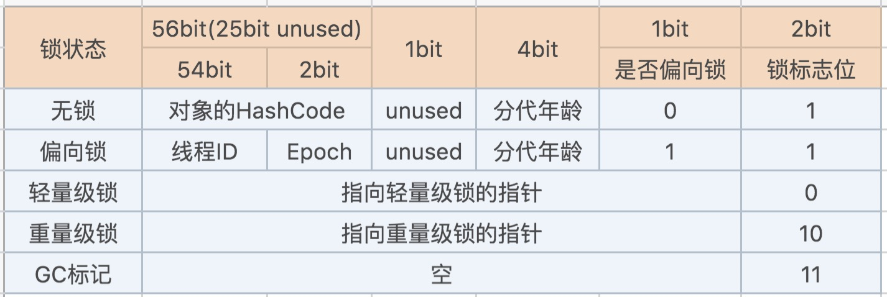

## JAVA内存区域初探

### JVM运行时内存区域

​	根据《Java虚拟机规范（JAVA SE 7版）》的规定，Java虚拟机所管理的内存会包含以下几个运行时数据区域：

+ 本地方法栈

  主要是虚拟机使用到的Native方法服务

+ 程序计数器

  每个线程所独有的一块较小的内存空间，字节码解释器所执行字节码指令时进行分支、跳转、循环、异常处理、线程恢复等基础功能等操作将依赖计数器的值来完成

+ 虚拟机栈

  描述的Java方法执行的内存模型。每个方法执行的时候都会创建一个栈帧，用于存储局部变量表、操作数栈、动态链接、方法返回等信息

+ 方法区

  用于存储已被虚拟机加载的类信息、常量、静态变量、即时编译器编译后的代码等信息。

  运行时常量池：也属于方法区的一部分，用于存储类被加载后Class文件中的常量池信息

+ 堆

  通常，大部分的对象都会存储在堆中，而垃圾回收的主要地方也是堆区。对于分代GC算法，堆被分成了新生代和老年代，新生代又细分为：Eden空间、From Survivor空间和To Survivor空间。

### HotSpot虚拟机对象

#### 对象的创建

​		1、对于普通对象（非数组和Class对象）的创建，虚拟机在遇到`new`指令时，首先检查这个指令的参数能否在常量池中定位到这个类的引用，并且坚持这个`符号引用`代表的类是否被加载，如果未加载、解析和初始化过。如果没有会先执行类的加载过程。

​		2、类加载检查完成后，会对新生对象分配内存空间。通常有两种方式：

+ 指针碰撞

  ​		假如堆中的空间是绝对规整的，已分配的空间在一边，空闲的内存在另一边，中间放着指针作为分界点，那么分配新对象的内存就是将指针往空闲内存区域移动一段与对象大小等同的距离。

+ 空闲列表

  ​		如果内存不够规则，那么虚拟机就得记录哪些内存空间可用，哪些不可用。在分配新对象空间的时候，就去列表找到一块足够大的内存空间供新对象使用，然后更新这个列表记录。

  对于并发情况，上述两种分配方式有可能造成分配空间冲突，通常用两种方式解决：

  + 对分配内存空间的动作采用同步方式，（虚拟机采用CAS配上失败重试的方式保证更新操作的原子性）

  + 每个线程在Java堆中预先分配一块内存，即（Thread Local Allocation Buffer，TLAB），虚拟机是否使用TLAB指令：UseTLAB。

  3、内存分配完成后，虚拟机将堆分配的内存空间设置初始值（半初始化）。

  4、完成初始值设定后，虚拟机对对象进行对象头等一些信息的设定，包括类的实例、对象的哈希码、对象的GC分代年龄等。

  5、接下来讲执行<init>方法，完成对象的真正初始化。

#### 对象的内存布局

​		在HotSpot虚拟机中，对象在内存中存储的布局包含：对象头、对象实例和对齐填充。

+ 对象头

  ​		对象头中主要包含类Mark Word、类元数据的指针，如果对象为数组，还包括了数组的长度。而Mark Word中包含了哈希码、GC分代年龄、锁状态标志、线程持有的锁、偏向锁线程ID、偏向时间戳等信息，对于这部分信息的数据长度，在32位和64位（未开启压缩指针）中分别为32bit和64bit，不足以存储下所有信息，所以Mark Word被设计成非固定的数据结构以便在极小的空间存储尽量多多信息。

  

+ 对象实例

  ​		此处存放的是对象的字段的一些值信息。

+ 对齐填充

  ​		通常对象存储都是整块（8bit的整倍数）存储，对于对象头+对象实例的大小不满足的情况下，会进行补齐填充，所以这部分并不是必然的。

#### 对象的访问定位

​		如果使用对象，通常是通过栈上的`reference`信息来定位到堆上的具体对象信息，而如何去寻找定位堆中的对象，取决于虚拟机的内部实现。主要有两种方式实现：

+ 句柄池方式

  堆中维护了一个句柄池，用于记录对象实例数据的指针和对象类型数据的指针。

  当对象被移动时，reference中的信息不会更改，而只会更改句柄池中的实例数据指针。

+ 直接引用方式

  堆中的对象实例数据中包含了对象类型数据的指针信息，可定位到方法区中的对象类型数据。

  采用这种方式，节省了一次指针定位的时间开销，所以访问方式较快，而HotSpot正是采用的这个方式。

