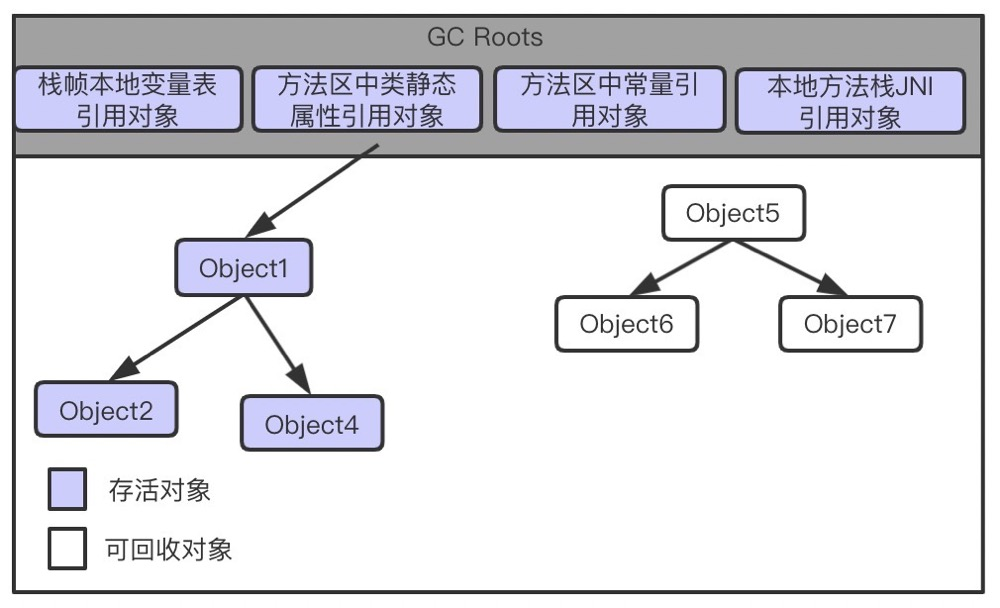

## JVM内存管理机制

对于GC而言，需要关注的问题有三点：

+ 哪些内存需要回收
+ 什么时候回收
+ 如何回收

​	对于第一个问题，JVM需要考虑的通常是堆区和方法区中的内存回收。对于堆区，我们主要考虑的是将不再使用的对象销毁，并释放内存空间。

### 垃圾定位

+ 引用计数法

每个对象都与一个引用计数器关联，当创建一个新的引用指向该对象后，计数器加1，当指向该对象的一个引用失效后，计数器减1，当计数器等于0时，表明该对象“死亡”。但是引用计数无法解决的问题是当有多个对象彼此循环引用后，这些对象将不会被当作“垃圾”回收“。

+ 可达性分析算法

从一系列`GC ROOTS`对象为起点，开始一路向下扫描，从起点开始所扫描的路径称为`引用链`（Reference Chain），当一个对象与`GC ROOTs`之间没有任何引用链相连，则这个对象可被回收。

如上图，尽管`Object5`、`Object6`、`Object7`之间有引用关系，但由于与`GC Roots`之间没有引用链相连，则这三个对象会被标识为可回收的对象。

***注意***

1、当对象与`GC Roots`对象无引用链相连时，对象并不会被立即当作回收对象。当发现对象与`GC Roots`对象引用链无引用关系时，会被第一次标记，并判断该对象是否有必要执行`finalize`方法。当对象没有覆盖`finalize`方法，或者`finalize`方法被执行过一次，虚拟机会判定该对象“没有必要执行”，对于没必要执行finalize方法的对象，将被回收。

2、当对象被判断可执行finalize方法时，对象被加入到一个`F-Queue`的队列中，然后由一个Finalizer线程触发执行这个方法，但并不保证等待执行结束。稍后，GC将对`F-Queue`队列进行第二次标记，如果对象在重写finalize方法中又与其他存活对象建立了引用关系（前提是该方法被成功执行并建立了引用关系），那么这个对象会“自救”成功，逃脱被回收的命运。

### 垃圾回收算法

+ 标记-清除算法
+ 复制算法
+ 标记-整理算法
+ 分代收集算法

### 内存分配策略

+ 对象优先在Eden分配
+ 大对象直接进入老年代
+ 长期存活的对象将进入老年代
+ 动态对象年龄判定
+ 空间分配担保

#### 

### 