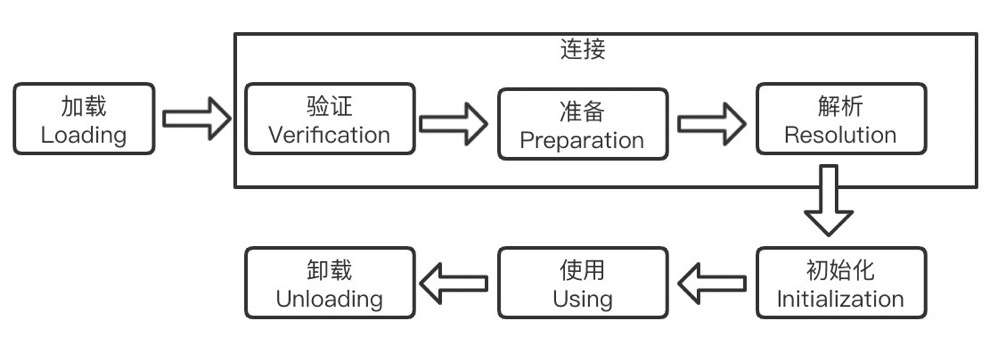
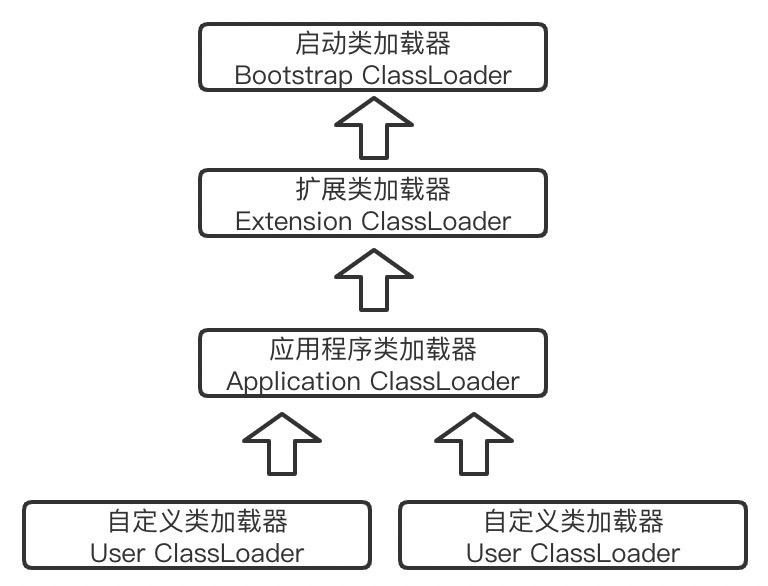

## JVM类加载机制详解

​		虚拟机的类加载机制：虚拟机把描述类型数据从`Class`文件加载到内存，对数据进行校验、转化解析和初始化，最终形成可以被虚拟机使用的`Java类型`。类型的加载、连接和初始化都在运行时期间完成，这样为Java程序提供了高度的灵活性。

### 类加载的时机

​		类从被加载到内存开始，到卸载出内存为止，会历经7个阶段，如下图：

​		其中验证、准备、解析三个阶段统称为`连接`阶段。

​		对于类的加载，JVM规范中并没有强制约束什么时候开始，但是对于初始化阶段，JVM规范严格规定了***有且只有***5种情况且***必须立即***对类进行初始化（如果没有初始化情况下）。

+ 遇到`new`、`getstatic`、`putstatic`或`invokestatic`这四条字节码指令时
+ 使用`java.lang.reflect`包对方法对类进行反射调用时
+ 当初始化一个类的时候，父类没有经过初始化，先触发其父类的初始化
+ 当jvm启动的时候，用户所指定的一个要执行的主类（包含main方法的类），需先初始化这个类
+ 当使用动态语言支持时，如果一个`java.lang.invoke.MethodHandle`实例最后的解析结果`REF_getStatic`、`REF_putStatic`、`REF_invokeStatic`的方法句柄，并且这个方法句柄所对应的类没有进行过初始化，则需先触发其初始化

### 类加载的过程

#### 加载

​		`加载`作为`类加载`的第一个阶段，虚拟机需要完成三件事：

1. 通过类的全限定名来获取此类的二进制字节流
2. 将这个字节流所代表的静态存储结构转化为方法区的运行时数据结构
3. 在内存中生存一个代表这个类的`java.lang.Class`对象，作为方法区这个类的各种数据的访问入口

#### 验证

​		此阶段主要是Class文件进行一些必要的验证，从《Java虚拟机规范（JavaSE7版）》整体上看，验证阶段大致会完成四个阶段的验证：

1. 文件格式验证：“语法校验”阶段
2. 元数据验证：“语义校验”阶段
3. 字节码验证：“语义逻辑校验”阶段
4. 符号引用验证

`-Xverify:none`参数可关闭大部分的类验证措施，缩短虚拟机类加载的时间。

#### 准备

​		准备阶段是正式为类变量（被static修饰的变量，非实例变量）分配内存并设置类变量初始值（数据类型的零值）的阶段，这些变量所使用的内存都在方法区中进行分配。

| 数据类型 |   零值   | 数据类型  | 零值  |
| :------: | :------: | :-------: | :---: |
|   int    |    0     |  boolean  | false |
|   long   |    0L    |   float   | 0.0f  |
|  short   | (short)0 |  double   | 0.0d  |
|   char   | '\u0000' | reference | null  |
|   byte   | (byte)0  |           |       |

当然，如果类字段的字段属性表中存在`ConstantValue`属性，那么就会 根据ConstantValue的值来设置类变量的值。

#### 解析

​		将Class文件中的符号引用转化为直接引用的一个过程。

#### 初始化

​		前面所说的阶段都是虚拟机主导和控制的（除了加载阶段调用自定义类加载器之外），初始化是真正开始执行类中定义的Java程序代码（字节码）。

初始化阶段是执行类构造器`<clinit>()`方法的过程。

关于`<clinit>()`方法：

+ 由编译器自动收集类中的所有类变量的赋值动作和静态语句块中的语句合并产生的，收集的顺序由语句在源文件中出现的顺序决定的。静态代码块中只能访问到语句块之前到变量，对于定义在它之后的变量，可以赋值，但不能访问

+ 与类的构造函数不同（或者说实例构造器`<init>()`），它不需要显式地调用父类构造器，虚拟机会保证在子类的`<clinit>()`方法执行前，先执行父类的`<clinit>()`方法

### 类加载器

​		类加载器的主要功能是通过一个类的全限定名来获取描述此类的二进制文件流，而这部分是在虚拟机外部实现的。在虚拟机中，对于任意一个类，都需要由加载它的类加载器和这个类本身一同确定其在虚拟机中的唯一性，所以我们判断两个类是否相等，必须是都由同一个类加载器加载为前提。

​		对于Java虚拟机而已，只有两种不同类型的类加载器

+ 启动类加载器

  由C++语言实现，是虚拟机的一部分

+ 其他类加载器

  由Java语言实现，独立于虚拟机外部，且全部继承抽象类：`java.lang.ClassLoader`

​		对于Java开发人员，类加载器可以划分的更细致：

+ 启动类加载器
+ 扩展类加载器
+ 应用程序类加载器
+ 自定义类加载器

#### 加载机制

​		类加载器之间通常采用双亲委派模型：除了启动类加载器外，其余的类加载器都应有自己的父类加载器（非继承关系），如下图：

​		双亲委派的工作过程是：如果一个类加载器收到了类加载的请求，它首先不回自己去尝试加载这个类，而是把这个请求委派给父类加载器去完成，只有当所有的父类加载器都无法完成这个加载请求时，子加载器才会尝试自己去加载。

#### 自定义类加载器

