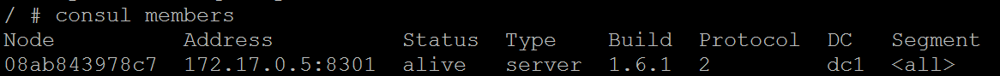
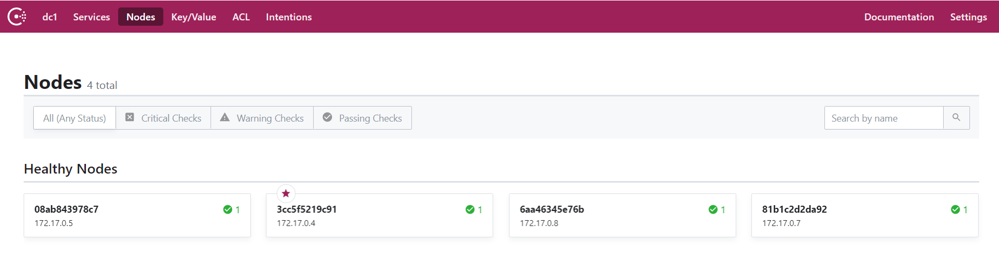

# consul环境配置

## install consul


### 普通下载安装
下载consul组件

`wget https://releases.hashicorp.com/consul/1.5.3/consul_1.5.3_linux_amd64.zip`

解压consul包

`unzip consul_1.5.3_linux_amd64.zip`

解压完成后，执行：`./consul`

启动consul

`./consul agent -dev -ui -bootstrap-expect=1 -data-dir=/tmp/consul -node=agent-dev -advertise=47.92.196.35 -bind=0.0.0.0 -client=0.0.0.0`


### docker 安装

1、拉取consul镜像

先执行`docker search consul`查看有哪些`consul`相关的镜像


2、这里我们下载第一个`consul`镜像

`docker pull consul`

3、下载完成后，启动`consul`容器

```docker
docker run -d -p 8500:8500 -v /data/consul:/consul/data -e CONSUL_BIND_INTERFACE='rth0' --name=consul_server_1 consul agent -server -bootstrap -ui -node=1 -client='0.0.0.0'
```

然后我们可以执行`docker ps`查看`consul`是否成功启动

### consul 高可用安装部署

consul高可用最好是3个或5个server端，其中一个为leader。

+ 启动server

1、先启动第一个server节点
```
docker run -d --name=consul_server1 -p 8500:8500 -e CONSUL_BIND_INTERFACE=eth0 consul agent --server=true --bootstrap-expect=3 --client=0.0.0.0 -ui
```

然后进入`consul_server1`的docker环境
` docker exec -it consul_server1 /bin/sh`

然后查看sonsul节点信息,这里查看`Address`，接下来的两个server节点会join到这个地址。
`consul member`



2、再启动第二个和第三个server节点
```
docker run -d --name=consul_server2 -e CONSUL_BIND_INTERFACE=eth0 consul agent --server=true --client=0.0.0.0 --join 172.17.0.4
```
```
docker run -d --name=consul_server3 -e CONSUL_BIND_INTERFACE=eth0 consul agent --server=true --client=0.0.0.0 --join 172.17.0.4

```

3、启动一个client节点
```
docker run -d --name=consul_client1 -e CONSUL_BIND_INTERFACE=eth0 consul agent --server=false --client=0.0.0.0 --join 172.17.0.4
```

在浏览器中打开`http://ip:8500/ui/dc1/nodes`




### consul配置参数和常用命令

1、配置参数

| 参数|说明|
|--|--|
|-server|指定节点为server模式，每个集群下的server至少1个，推荐3个或5个|
|-client|指定节点为client模式|
|-join|将节点加入到集群|
|-data-dir|指定agent储存状态的数据目录|
|-config-dir|指定service的配置文件和检查定义所在的位置|
|-config-file|指定一个要装载的配置文件|
|-bootstrap-expect|通知consul server我们现在准备加入的server节点个数，该参数是为了延迟日志复制的启动直到我们指定数量的server节点成功的加入后启动|
|-node|指定节点在集群中的名称|
|-datacenter|指定节点加入到那个数据中心|


