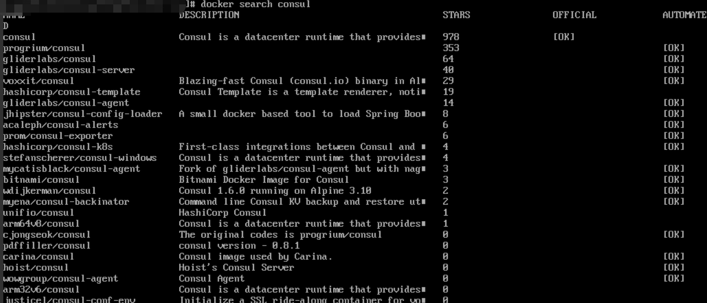

# consul环境配置

## install consul

### windows

### centos

#### 普通下载安装
下载consul组件

`wget https://releases.hashicorp.com/consul/1.5.3/consul_1.5.3_linux_amd64.zip`

解压consul包

`unzip consul_1.5.3_linux_amd64.zip`

解压完成后，执行：`./consul`

启动consul

`./consul agent -dev -ui -bootstrap-expect=1 -data-dir=/tmp/consul -node=agent-dev -advertise=47.92.196.35 -bind=0.0.0.0 -client=0.0.0.0`


#### docker 安装

1、拉去consul镜像

先执行`docker search consul`查看有哪些`consul`相关的镜像


2、这里我们下载第一个`consul`镜像

`docker pull consul`

3、下载完成后，启动`consul`容器

```docker
docker run -d -p 8500:8500 -v /data/consul:/consul/data -e CONSUL_BIND_INTERFACE='rth0' --name=consul_server_1 consul agent -server -bootstrap -ui -node=1 -client='0.0.0.0'
```

然后我们可以执行`docker ps`查看`consul`是否成功启动


### macos