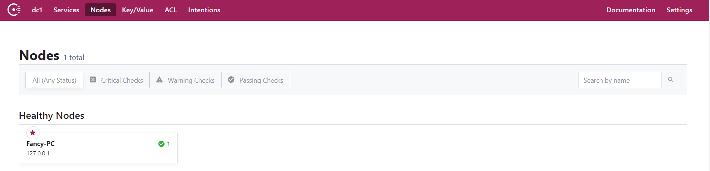

第二章 `Spring Cloud`集成`Consul`实现服务发现

本章讲解`Spring Cloud`集成`Consul`实现服务注册发现功能，`Consurl安装`参考[Consul环境配置](./1、Consul环境配置.md)；如果采用`Eureka`作为服务发现组件，请参考[1、Eureka服务注册与发现](../eureka/1、Eureka服务注册与发现.md)。

## consul本地安装

[下载`consul`安装包](https://www.consul.io/downloads.html)

解压后放到指定路径，例如：`E:\Program\consulsoft`，配置环境变量`path`:`E:\Program\consulsoft`。

在`cmd`中运行`consul agent -dev`，然后在浏览器中输入：`localhost:8500`。

## spring cloud consul实现服务注册和发现

