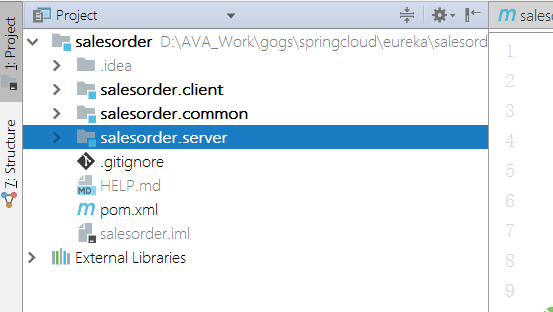
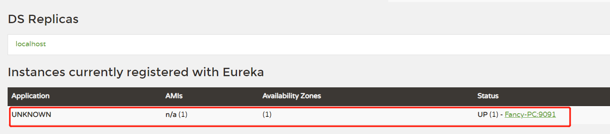
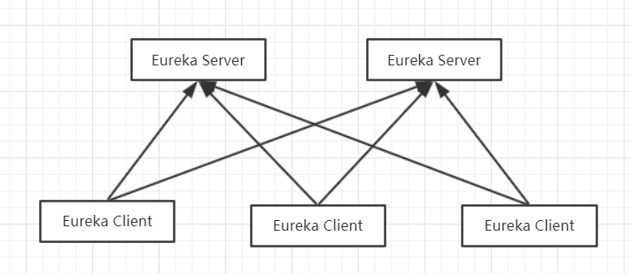

# 第一章 spring cloud 集成eureka实现服务注册与发现（Greenwich.SR3版本）

## 组件

+ eureka server

+ eureka client

## 搭建eureka server

### 1、新建项目

 1、新建父项目，选择spring initializr，输入项目相关信息后，选择Spring Cloud Discovery -> Eureka Server.

 2、删除.mvn和src文件夹，新建module。右键选择项目名称，New -> module，选择maven即可。

### 2、添加注解和相关依赖

 1、启动类添加注解`@EnableEurekaServer`

 2、父项目添加依赖

```maven
    <dependency>
        <groupId>org.springframework.cloud</groupId>
        <artifactId>spring-cloud-starter-netflix-eureka-server</artifactId>
	</dependency>
```

相关版本管理

```maven
    <properties>
		<java.version>1.8</java.version>
		<spring-cloud.version>Greenwich.SR3</spring-cloud.version>
	</properties>

    <dependencyManagement>
		<dependencies>
			<dependency>
				<groupId>org.springframework.cloud</groupId>
				<artifactId>spring-cloud-dependencies</artifactId>
				<version>${spring-cloud.version}</version>
				<type>pom</type>
				<scope>import</scope>
			</dependency>
		</dependencies>
	</dependencyManagement>
```

启动服务后，浏览器输入localhost:8080,已经显示出界面。但是控制台中打印出错误日志：Cannot execute request on any known server。这是因为Eureka server即是服务端，也是客户端，它会将自己当作一个客户端注册到服务中心，我们增加配置让其不注册即可。
```json
eureka:
  client:
    register-with-eureka: false
    fetch-registry: false
```

关于spring cloud与spring boot版本匹配关系可查看官网：`https://spring.io/projects/spring-cloud`

## 搭建Eureka Client项目

1、新建项目，构建出如下图结构的多模块项目。初始化project时，spring cloud discovery选择Eureka Discovery Client。



2、在salesorder.server中编写服务代码

+ 添加完Application类并添加`@EnableDiscoveryClient`注解。
+ 添加SalesOrderController服务

mvn编译，启动服务。
发现控制台报错：
```log
com.sun.jersey.api.client.ClientHandlerException: java.net.ConnectException: Connection refused: connect
```

这是因为Client端要向服务端注册，但是没有配置Server端地址，Client会向Eureka默认端口8761注册，但是我们刚刚的server端配置的端口并不是8761，所以无法注册成功。

在配置文件中加入服务的配置信息：
***端口为Server端配置的端口***

```yml
eureka:
  client:
    service-url:
      defaultZone: http://localhost:8076/eureka
```

重新启动，client端实例注册成功



Application的名称可通过配置`spring.application.name`进行修改.

## 相关配置
1、服务相互注册配置

现在，我们可以启动多个Server和Client端来保证服务的高可用了。



2、注册中心提示如下错误：
``` message
EMERGENCY! EUREKA MAY BE INCORRECTLY CLAIMING INSTANCES ARE UP WHEN THEY'RE NOT. RENEWALS ARE LESSER THAN THRESHOLD AND HENCE THE INSTANCES ARE NOT BEING EXPIRED JUST TO BE SAFE.
```
此警告提示是由于Eureka默认启动了保护机制，Server在运行期间会统计心跳失败的比例，如果15分钟内低于85%会出现该提示。生产环境可能由于网络不稳定导致此情况出现，开发环境可通过关闭保护机制去除该警告提示。
``` yml
eureka:
 server:
  enable-self-preservation: false
```


