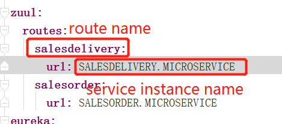
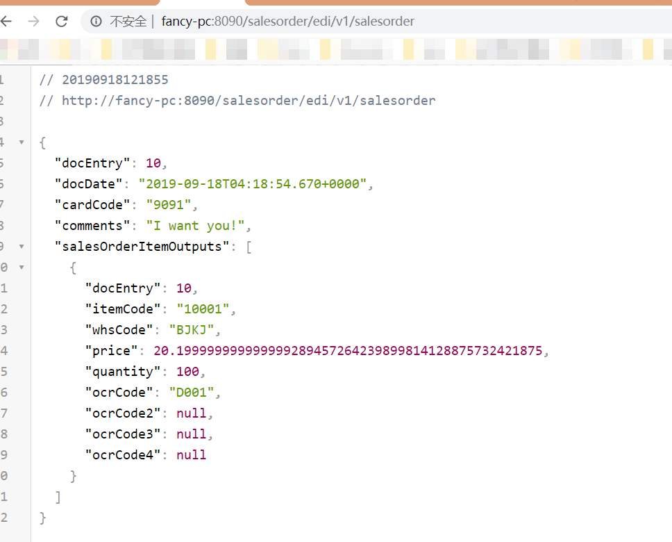
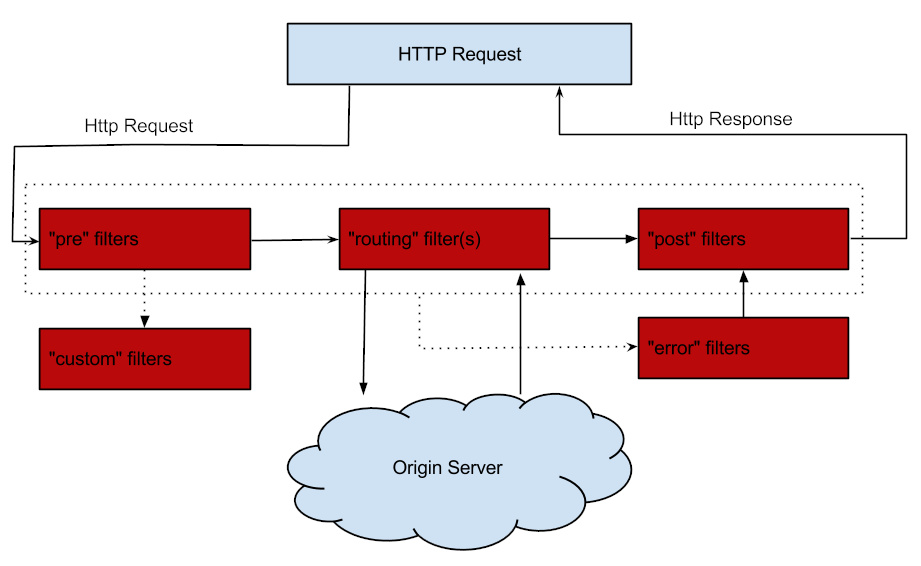

# 第四章 spring cloud 集成Zuul组件（Greenwich.SR3版本）

## 概述
    `什么是服务网关`
    ``` description

    ```

    `为什么要引入服务网关`
    ``` description
    + 身份校验

    + 流量控制


    ```


## 路由

1、添加maven依赖

```maven
    <dependency>
        <groupId>org.springframework.cloud</groupId>
        <artifactId>spring-cloud-starter-netflix-zuul</artifactId>
    </dependency>
    <dependency>
        <groupId>org.springframework.cloud</groupId>
        <artifactId>spring-cloud-starter-netflix-eureka-client</artifactId>
    </dependency>
```
2、application添加注解`@EnableZuulProxy`

3、将api-gateway注册到eureka注册中心上
```yml
eureka:
  client:
    service-url:
     defaultZoon: http://localhost:8761/eureka
```

4、配置路由信息
```yml
zuul:
  routes:
    salesdelivery:
      url: SALESDELIVERY.MICROSERVICE
    salesorder:
      url: SALESORDER.MICROSERVICE
```
注意`salesdelivery`、`salesorder`为路由名称，`SALESDELIVERY.MICROSERVICE`、`SALESORDER.MICROSERVICE`为具体的服务实例名称。


5、通过gateway访问内部服务接口


可以看到结果与开始访问salesorder的服务结果一致。

## 过滤器

### 过滤器生命周期



+ ***PRE***：这种过滤器在请求被路由之前调用。我们可利用这种过滤器实现身份验证、在集群中选择请求的微服务、记录调试信息等。
+ ***ROUTING***：这种过滤器将请求路由到微服务。这种过滤器用于构建发送给微服务的请求，并使用 Apache HttpClient 或 Netfilx Ribbon 请求微服务。
+ ***POST***：这种过滤器在路由到微服务以后执行。这种过滤器可用来为响应添加标准的 HTTP Header、收集统计信息和指标、将响应从微服务发送给客户端等。
+ ***ERROR***：在其他阶段发生错误时执行该过滤器。 除了默认的过滤器类型，Zuul 还允许我们创建自定义的过滤器类型。例如，我们可以定制一种 STATIC 类型的过滤器，直接在 Zuul 中生成响应，而不将请求转发到后端的微服务。


### 默认实现的Filter


### 自定义Filter

如我们要实现一个功能：url中必须带有token，否则响应无效token。

1、添加`TokenFilter`类，并继承`ZuulFilter`。

`ZuulFilter`是一个抽象类，包含两个抽象方法:`filterType()`、`filterOrder()`;
`ZuulFilter`实现`IZuulFilter`接口，`IZuulFilter`中含有两个方法：`shouldFilter()`、`run()`。
因此，我们的`TokenFilter`类中需要实现四个方法。

|方法   |描述   |
|-------|-------|
|filterType()|过滤器类型，决定过滤器在哪个生命周期执行|
|filterOrder()|filter执行顺序，数字越大，优先级越低|
|shouldFilter()| 判断该过滤器是否需要被执行,实际运用中我们可以利用该函数来指定过滤器的有效范围|
|run()|过滤器的具体逻辑|

我们在run方法中实现我们token校验的逻辑：
``` java
    @Override
    public Object run() throws ZuulException {
        RequestContext ctx = RequestContext.getCurrentContext();
        HttpServletRequest request = ctx.getRequest();
        String token = request.getParameter("token");
        if (token == null || token.isEmpty()) {
            ctx.setSendZuulResponse(false);
            ctx.setResponseStatusCode(401);
            ctx.setResponseBody("token is empty");
        }
        return null;
    }
```

2、为Filter创建Bean

在Application中添加Bean注解
```java
    @Bean
    public TokenFilter tokenFilter() {
        return new TokenFilter();
    }
```

3、重启api-gateway服务，测试salesdelivery服务

访问http://localhost:8090/salesorder/edi/v1/salesorder，响应`token is empty`;

访问http://localhost:8090/salesorder/edi/v1/salesorder?token=XXX，响应正确结果。

如果未加token参数仍响应正确结果，请检查：
+ 是否创建Bean

+ shouldFilter()方法中是否能返回true

## 参考

[Spring Cloud Zuul](https://spring.io/guides/gs/routing-and-filtering/)

[Spring Cloud（十一）：服务网关 Zuul（过滤器）【Finchley 版】](https://windmt.com/2018/04/23/spring-cloud-11-zuul-filter/)


