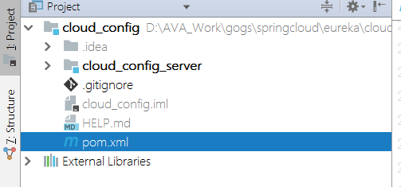
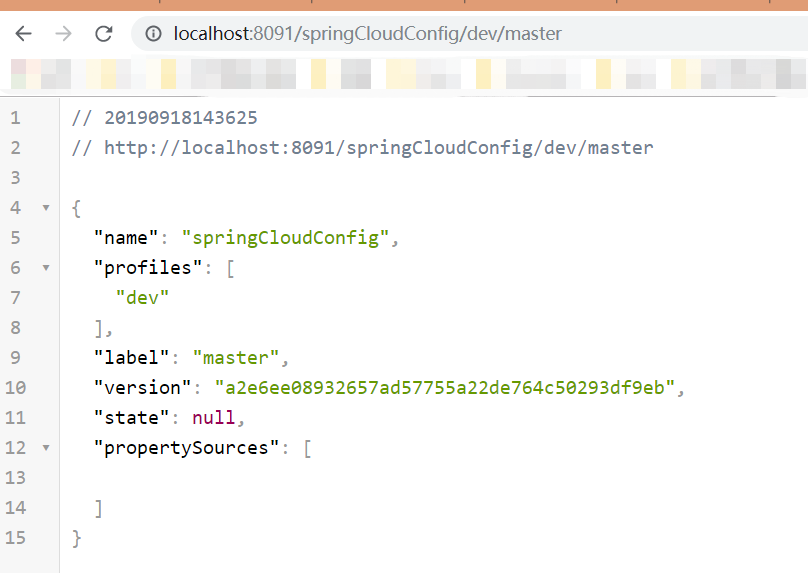

# Spring Cloud Config配置中心（Greenwich.SR3版本）

## 配置中心简介

## spring cloud config server端示例

按照以往逻辑，使用spring cloud组件三大步骤：添加依赖、添加注解、添加配置。

我们新建一个project，并将其改成多模块。


### 1、添加maven依赖

``` maven
<dependency>
    <groupId>org.springframework.cloud</groupId>
    <artifactId>spring-cloud-config-server</artifactId>
</dependency>
```

2、`Application`类中添加注解`@EnableConfigServer`

3、application.yml配置中添加如下配置：
``` yml
spring:
  application:
    name: config.server
  cloud:
    config:
      label: master
      server:
        git:
          uri: your github repsitory url(https://github.com/fancys/edi-config.git)
          search-paths: your repsitory name(edi-config)
          username: you github username
          password: you github password
```

4、访问http://localhost:8091/springCloudConfig/dev/master



说明配置中心服务端已经能从远程仓库获取信息。

***注意***
http请求和资源文件的映射关系如下：
+ `/{application}/{profile}[/{label}]`
+ `/{application}-{profile}.yml`
+ `/{label}/{application}-{profile}.yml`
+ `/{application}-{profile}.properties`
+ `/{label}/{application}-{profile}.properties`

## spring cloud config client端示例

下面我们改造`salesdelivery`项目，实现在salesdelivery中访问github上配置文件内容。

### 1、添加依赖

``` maven
 <dependency>
    <groupId>org.springframework.cloud</groupId>
    <artifactId>spring-cloud-config-client</artifactId>
</dependency>
```

### 2、在github上的application-dev.yml便捷内容
``` yml
content: hello,dahub!
```

### 3、在`salesdelivery`项目的controller中添加注解获取配置文件内容
``` java
    @Value("${content}")
    String content;
```

### 4、添加配置
``` yml
spring:
  cloud:
    config:
      label: master
      profile: dev
      uri: http:localhost:8091/
```

重新启动`salesdelivery`模块服务，报错：
``` error
Could not resolve placeholder 'content' in value "${content}"
```
仔细检查控制器错误信息，发现第一行信息：


我们配置了config server端地址是http://localhost:8091，但是加载的地址确实http://localhost:8888。

***说明***

这是因为加载`config server`会在`application.yml`之前加载，而`config server`默认的端口是8888，所以此时加载的端口仍然是8888。
此时我们需要添加配置文件`bootstrap.yml`,我们服务会首先加载`bootstrap.yml`配置信息，这样就能让服务加载正确的`config server`地址了。

`bootstrap.yml`
``` yml

```

重启后，仍然报错：` Could not resolve placeholder 'content' in value "${content}"`；但能正确找到`config server`地址。

***此问题待解决***

## 动态刷新


