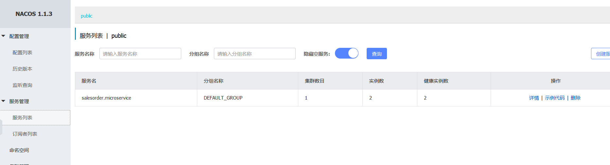

# 使用spring cloud alibaba nacos 实现服务注册和服务消费

## Nacos简介

### Nacos安装

windows版本：直接从官方下载指定release包，CMD 执行`startup.cmd`；
linux版本：参考 [Centos系统安装Nacos单机版本](../../linux/install/Centos下安装Nacos单机版.md)


启动注册中心服务后，在浏览器输入：`127.0.0.1/nacos`，用户名密码默认`nacos`。


## Nacos实现服务注册

我们要实现一个`salesorder`服务，首先创建`salesorder`的提供者服务，并注册到nacos上。

### 创建服务提供者

创建多模块项目，如果问题，可以参考[spring cloud 集成eureka实现服务注册与发现（Greenwich.SR3版本）](../eureka/1、eureka服务注册与发现.md)

### 添加依赖
由于Nacos暂时未纳入`spring cloud`官方版本，所以需要在`dependencyManagement`加入依赖

```maven
<dependencyManagement>
		<dependencies>
			<dependency>
				<groupId>org.springframework.cloud</groupId>
				<artifactId>spring-cloud-dependencies</artifactId>
				<version>${spring-cloud.version}</version>
				<type>pom</type>
				<scope>import</scope>
			</dependency>
			<dependency>
				<groupId>org.springframework.cloud</groupId>
				<artifactId>spring-cloud-alibaba-dependencies</artifactId>
				<version>0.2.2.RELEASE</version>
				<type>pom</type>
				<scope>import</scope>
			</dependency>
		</dependencies>
</dependencyManagement>
    <dependencies>
		<dependency>
			<groupId>org.springframework.boot</groupId>
			<artifactId>spring-boot-starter</artifactId>
		</dependency>
		<dependency>
			<groupId>org.springframework.cloud</groupId>
			<artifactId>spring-cloud-starter-alibaba-nacos-discovery</artifactId>
		</dependency>
		<dependency>
			<groupId>org.projectlombok</groupId>
			<artifactId>lombok</artifactId>
			<version>1.18.8</version>
			<optional>true</optional>
		</dependency>
		<dependency>
			<groupId>org.springframework.boot</groupId>
			<artifactId>spring-boot-starter-test</artifactId>
			<scope>test</scope>
		</dependency>
		<dependency>
			<groupId>org.springframework.boot</groupId>
			<artifactId>spring-boot-starter-web</artifactId>
		</dependency>
	</dependencies>
```
### 添加注解

`Application`主类中添加`@EnableDiscoveryClient`注解。

此注解是`spring cloud`的规范，`Nacos`、`Erueka`、`Consul`等都是实现`spring cloud`规范。

所以如果我们是从`Erueka`迁移到`Nacos`，此处不用更改。

### 更改配置

接下来只需要将服务提供者注册到`Nacos`注册中心即可。

```yml
server:
  port: 8080
spring:
  cloud:
    nacos:
      discovery:
        server-addr: 127.0.0.1:8848
  application:
    name: salesorder.microservice
```




## Feign实现服务消费


## 总结


## 参考

[github nacos](https://github.com/alibaba/nacos)

[nacos.io](https://nacos.io/zh-cn/docs/what-is-nacos.html)

[Spring Cloud Alibaba基础教程：使用Nacos实现服务注册与发现](http://blog.didispace.com/spring-cloud-alibaba-1/)

[Spring Cloud Alibaba基础教程：支持的几种服务消费方式（RestTemplate、WebClient、Feign）](http://blog.didispace.com/spring-cloud-alibaba-2/)

