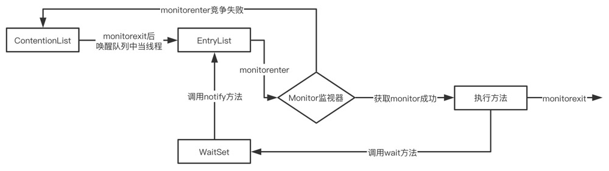
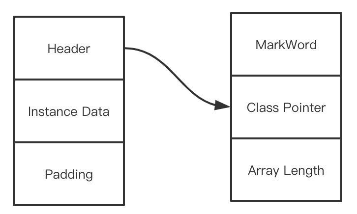
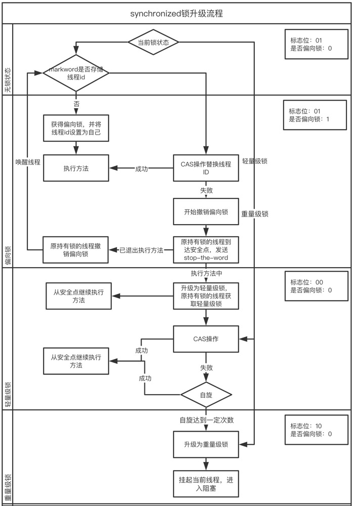

##synchronized的基本使用

###定义

​		` synchronized`是java提供的关键字，作为JVM实现的一个内置锁，用来保证多任务下防止资源争抢冲突。当任务执行到被`synchronized`关键字保护到代码块时，先检查锁是否可用，然后获取锁，再执行代码，释放锁。

###  使用方式

+ 普通同步方法

  ```java
  private synchronized void like(){
      //TODO ;
  }
  ```

+ 静态同步方法

  ```java
  private synchronized static void like(){
      //TODO ;
  }
  ```

+ 同步代码块

  ```java
  private void like(int likeCount) {
    	synchronized (this){
      	//TODO
    	}
  }
  ```

***要注意的是：synchronized锁的不是方法或代码块，而是对象，静态同步方式锁的是Class对象，普通同步方法和同步代码块锁的是当前对象***

### 锁对象

​		共享资源一般以对象的形式存在的内存片段，如果要实现对共享资源的并发安全控制，首先要将其封装在对象中。每个java对象都含有单一的锁，任务要执行被`synchronized`标记的代码时，首先要持有该对象的锁，待执行完成后，释放锁资源。

​		通过反编译，查看具体字节码的实现，可以发现：

1、`synchronized`在修饰代码块时，是由`monitorenter`和`monitorexit`指令来实现同步的，进入`monitorenter`指令后，线程持有`monitor`对象，退出`moitorexit`后释放该对象。

2、`synchronized`在修饰方法时，没有出现`monitorenter`和`monitorexit`指令，而是出现了一个`ACC_SYNCHRONIZED`标志。JVM将通过这个标志来区分这是否一个同步方法，如果有该标志，线程将先持有`monitor`对象，然后再执行方法。

​		`JVM`中的同步是基于进入和退出管程`Monitor`来实现的，Java中每个对象都包含有`monitor`对象，它是随对象一起创建和销毁的。`monitor`对象由`ObjectMonitor`来实现的，如下图：

```C++
ObjectMonitor() {
   _header = NULL;
   _count = 0; //记录个数
   _waiters = 0,
   _recursions = 0;
   _object = NULL;
   _owner = NULL;
   _WaitSet = NULL; //处于wait状态的线程，会被加入到_WaitSet
   _WaitSetLock = 0 ;
   _Responsible = NULL ;
   _succ = NULL ;
   _cxq = NULL ;
   FreeNext = NULL ;
   _EntryList = NULL ; //处于等待锁block状态的线程，会被加入到该列表
   _SpinFreq = 0 ;
   _SpinClock = 0 ;
   OwnerIsThread = 0 ;
}
```

​		当多个线程执行到同步方法时，线程信息会记录到ContentionList和EntryList中，当线程获取到对象的Monitor后，Monitor依靠底层操作系统的Mutex Lock实现互斥，这时其他对象将无法获取到Monitor对象，竞争失败的线程会再次进入ContentionList。如果线程获取到Monitor对象后，调用了wait()方法，该线程会进入WaitSet中，等待下一次被唤醒。



### 锁优化与锁升级

​		由于Monitor是依靠底层操作系统来实现的，会存在用户态与内核态之间的切换，造成较大的性能开销。所以在***JDK1.6***后，对synchronized进行了优化，引入`偏向锁`，`轻量级锁`，`重量级锁`对概念，通过对锁的升级优化了上下文切换的性能问题。

+ 对象内存分布

  在HotSpot虚拟机中，对象在内存中的布局包括3类：对象头，实例数据和补充对齐。对象头中包含了`Mark Word`和`类型指针`，即对象指向它的类元数据的指针，而对于数组对象，对象头中还包含了数组长度信息。

   

  在`markdown`中记录了对象和锁相关的一些信息。

| 存储内容                             | 是否偏向锁 | 标识位 | 状态             |
| :----------------------------------- | ---------- | ------ | ---------------- |
| 对象哈希码、对象分代年龄             | 0          | 01     | 未锁定（无锁）   |
| 指向锁记录的指针                     |            | 00     | 轻量级锁         |
| 指向重量级锁的指针                   |            | 10     | 膨胀（重量级锁） |
| 空，不需要记录                       |            | 11     | GC标记           |
| 偏向线程ID、偏向时间戳、对象分代年龄 | 1          | 01     | 可偏向           |

+ 偏向锁

  ​		如果多数情况下，都是同一个线程竞争锁资源，每次都需要获取和释放锁，那么每次都会发生用户态和内核态的切换，造成不必要的消耗。偏向锁的作用就是在同一线程再次访问同步方法（代码块）时，只需去对象头的MarkWord中判断是否有偏向锁，且偏向线程id为当前线程id，就无需再进入Monitor竞争资源了。此时`锁标志位`还是01，`是否偏向锁标志位`设置为1。

  ​		偏向锁实用于单个线程竞争锁资源的情况，当高并发情况下，

+ 轻量级锁

  ​		当对象`是否偏向锁标志位`为1时，此时有另外一线程来竞争资源，如果偏向线程id不是自己的线程id，将进行CAS操作获取锁，如果获取成功，将偏向锁id更新为当前线程ID，如果获取失败，则将偏向锁升级为轻量级锁。

  ​		轻量级锁适用于线程交替执行，且执行时间较短，大部分的线程在整个同步周期内不存在长时间竞争的场景。

+ 自旋锁与重量级锁

  ​		轻量级锁CAS操作竞争失败后，会通过自旋方式不断尝试获取锁（自旋次数可以在JVM中设置），如果在自旋过程中，持有锁的线程还未释放锁，那么同步锁将升级为重量级锁。

  ​		在锁竞争不激烈，且锁占用时间非常短的情况下，自旋锁可以提高系统性能。但是锁竞争激烈或锁占用时间较长的情况下，自旋锁会导致大量的线程一直处于CAS自旋状态，浪费CPU资源，反而增加了系统性能开销。

  ​		在高负载、高并发情况下，可以通过设置JVM参数来关闭自旋锁，优化系统性能。

  ```jvm
  -XX:-UseSpinning //关闭自旋锁优化（JDK1.7默认打开）
  -XX:PreBlockSpin //参数修改默认的自旋次数（JDK1.7后去掉了此参数，有JVM控制）
  ```

​	锁升级流程图：



### 总结

+ JDK1.6中引入锁升级机制优化了锁的性能

+ 偏向锁降低了单个线程重复获得锁的代价

+ 轻量级锁通过CAS方式降低了执行时间较短且交替执行的线程之间竞争锁资源的开销

+ 如果锁竞争太激烈，或某一线程占用锁资源时间较长，将升级为重量级锁

+ 优化synchronized锁性能：减少锁竞争，减小锁粒度或锁粗化

  

### 参考

《Java编程思想》

《Java并发编程实战》

《深入理解虚拟机》


