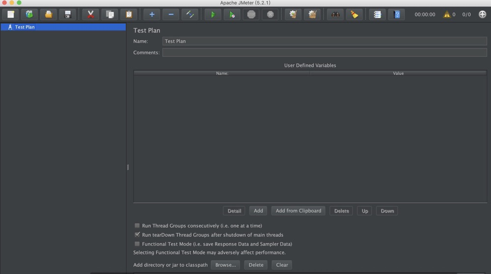

#jmeter入门简介


## jmeter安装

 [jmeter安装包下载](https://jmeter.apache.org/download_jmeter.cgi)

> 注意：jmeter由java开发，需安装jdk，各个版本对jdk有不同版本要求。


下载完成解压后，进入bin目录，执行`jmeter`命令启动jmeter。




## 测试http请求

+ 新建测试计划

  选择【文件】->【新建】

  *一般打开jmeter后会默认新建测试计划*

+ 新建线程组

  


线程组中有三个重要线程属性（对于并发测试需要设置）：

​	1、线程数：开启多少个线程执行请求

​    2、ramp-up period：单位时间内发起等同线程数量的测试请求

​	3、循环次数：如若勾选永远，则一直循环执行。


## 监听测试结果

+ 新建测试请求

  右键选择新建的线程组，【添加】->【取样器】->【Http请求】


​	填写好服务器ip、端口、请求方式、及url路径。

​	body消息填写至【消息体数据】，如果采用【json】格式，需在header添加`Content-Type`属性。

+ 添加header属性

  右键新建的`http请求`，选择【添加】->【配置元件】->【HTTP信息头管理器】

  

​	添加相应的header属性：


+ 执行测试请求

`jmeter`工具栏上有两个 常用的按钮，【执行按钮】和【清楚按钮】。


+ 查看测试结果

  我们可以通过【察看结果树】获取测试结果。

  如果只需要查看单个请求的结果，可以右键新建的`http请求`，【添加】->【监听器】->【察看结果树】；如果需要查看多个请求的结果，只需针对`线程组`新建`察看结果树`即可。

  


测试结果如下：


## 参数取值

+ 自定义变量

  ​		通常，我们测试计划中包含多个测试接口，而这些接口数据中含有一些公共的值，如果`服务器ip`，`端口`。这些值一但发生变更，我们需要一个个去调整接口。此时，可以定义一些公共变量，然后在接口中引用这些变量即可。

  ​		右键新建的`线程组`，【添加】->【配置元件】->【用户自定义的变量】，自定义变量是以`key-value`形式存储，在使用的时候只需输入`${variableName}`即可。


+ 提取器

  ​		通常，我们接口是有关联性的，如A接口会用到B接口返回的数据，此时我们需要提取出B接口返回的信息，并在A接口请求的时候赋值。此时我们可以采用提取器来实现。

  ​		在`jmeter`中，常用的实现方式是在`后置处理器中`添加`json提取器`或者`正则表达式提取器`。

  ​		假如我们的接口都需先登录获取token后，才可成功请求，且登录返回的json格式如下：

  ```json
  {
      "access_token": "1f49e52a-e20c-4dc0-a52d-6db3bebfe02b",
      "token_type": "bearer",
      "refresh_token": "f5461cce-46d3-4fc5-bffa-938d544f4b54",
      "expires_in": 3599,
      "scope": "read"
  }
  ```

  下面采用`json提取器`和`正则表达式提取器`分别来实现。

  - json提取器

    新建`登录`http请求，并选中登录请求，【添加】->【后置处理器】->【json选择器】

    

  

  - 正则表达式提取器

    选中新建的`http请求`，【添加】->【后置处理器】->【正则表达式提取器】

    

    然后在其他接口使用${variblesName}占位符即可。

+ 调试取样器

  ​		对于提取器定义的变量，我们可以在调试取样器中，查看提取的值是否符合预期，以判断我们的提取器是否书写正确。

  ​		`调试取样器`只能在`线程组`中添加，选中新建的线程组，【添加】->【取样器】->【调试取样器】

  

  ​		执行http请求后，可在线程组下的`察看结果树`中找到`调试取样器`，点击相应数据，可以看到刚刚提取器中定义的变量。

